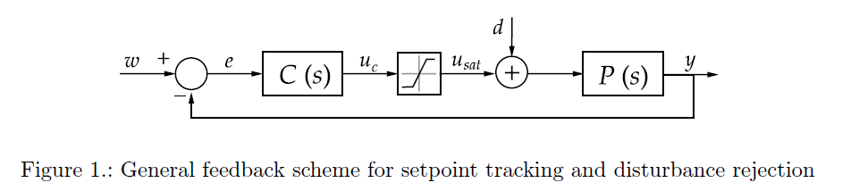

# 前置

## 研究对象

文章主要对一阶纯延迟（FOPDT）系统进行研究

### 标准形式

FOPDT 系统的传递函数通常写成：

$$
G(s)=\frac{Ke^{-Ls}} {Ts+1}
$$

其中：

- **K**：系统增益（steady-state gain）
- **T**：时间常数（响应“快慢”）
- **L**：纯延迟时间（dead time / time delay）


---

-----

## 积分饱和（The Windup Problem）

> 执行器饱和在反馈控制系统中引入了一种基本的非线性特性，改变了控制器设计时所假设的名义闭环行为。图1展示了设定点跟踪和扰动抑制问题的标准反馈结构，其中 $w$ 是被控变量 $y$ 的设定点，$e=w−y$ 是误差， $d$是负载扰动，$u_c$ 是控制器输出，$u_{sat}$ 是饱和后实际施加的控制作用，$P(s)$ 和 $C(s)$ 分别是过程传递函数和PID控制器（拉普拉斯域）。



> 在工业中使用PID控制器时，必须考虑执行器饱和，最终的控制作用 $u_{sat}$ 总是受到执行器限幅的约束。当控制器输出 $u_c$ 超过执行器限幅时，执行器将保持在限幅值，系统以开环方式运行。此外，只要误差不为零，积分作用就会继续增加，导致积分项变得非常大，这种效应称为“积分饱和”。

饱和指 PID 控制器的输出 $u_c$ 超出了执行器上限，被限制在 $u_{max}$ 。即执行器性能不足，无法理想地快速响应以达到目标值。这会进一步导致积分器过度累计以至于最终超调等问题。


---

-----

## λ方法 

> **Åström & Hägglund（2006）提出的一种基于 FOPDT 模型的 IMC-PID（内部模型控制 PID）整定方法**

### 核心思想

根据期望的系统响应速度反推 PID 参数

### 核心结构

来自于 **IMC(Internal Model Control)** 思想。

### λ 的物理意义

λ = 闭环时间常数（desired closed-loop time constant）

| λ 大     | 系统响应慢 | 稳定、鲁棒           |
| -------- | ---------- | -------------------- |
| **λ 小** | **响应快** | **更激进、可能振荡** |

### 公式

对于 PID 形如
$$
u(t)=K_p\left[e(t)+\frac{1}{T_i}\int_0^t e(\tau)d\tau + T_d \frac{de(t)}{dt}\right]
$$

或拉普拉斯形式：
$$
G_c(s)=K_p\left(1+\frac{1}{T_is}+T_ds\right)
$$


#### （1）PI 控制（常见）

$$
K_p = \frac{T}{K(λ+L)}\\
T_i = T
$$

#### （2） PID 控制

$$
K_p=\frac{T+0.5L}{K(λ+0.5L)}\\
T_i=T+0.5L\\
T_d=\frac{TL}{2T+L}
$$

### λ的工程约束（重要）

**推荐原则：**
$$
λ\geq L
$$
或更保守：
$$
λ\in[L,3L] 或 [L,5L]
$$
原因：L是不可控延迟，λ太小则必然震荡


---

-----

## 在积分饱和下的示例&困境

所有案例处于场景：$K=1$, $T=3$, $L=0.5$ 的一阶纯延迟系统
$$
P(s)=\frac{K}{Ts+1}e^{-Ls}=\frac{1}{3s+1}e^{-0.5s}
$$
用 λ方法 整定PID参数。期望闭环时间常数 $λ=0.2T$​ .


>前两个案例对应于设定点跟踪问题。在图2左侧的例子中，饱和发生在设定点变化后的瞬态过程中，控制作用暂时达到执行器限幅但最终回到线性区域。这导致控制信号在饱和期间持续增长，造成恢复缓慢以及过程输出超调。相比之下，图2右侧的例子显示了一种情况：执行器在稳态下饱和，即达到参考值所需的控制作用超过了执行器限幅，使得设定点无法达到。除了第一个设定点不可达之外，当引入第二个阶跃时，积分作用已变得非常大，导致跟踪缓慢，过程输出需要很长时间才能达到设定点。


> PS: saturation 理解为执行器限幅 or 输出限幅


> 最后一个案例对应于扰动抑制问题。图3展示了对负载扰动的响应，控制器必须抵消扰动，常常导致持续饱和。在扰动期间，控制作用超过执行器限幅，一旦扰动结束，积分作用变得如此之大，以至于过程输出的恢复比没有饱和时慢得多。


> PS: 第一行中 Reference 一直为0, 那个方波是 Disturbance.


在所有案例中，饱和导致控制器输出与实际施加的控制作用之间不匹配，使得积分项以与实际系统动态不一致的方式累积。由此产生的积分饱和效应根据控制目标和系统配置表现出不同的形式，这促使需要针对每种场景定制抗饱和策略和整定规则。

显然，执行器饱和会降低系统性能，必须采用抗饱和技术来减轻其影响。然而，选择并整定抗饱和方案并非易事，它取决于多个因素，包括过程和扰动动态以及控制器的整定方法（Bohn & Atherton, 1995）。为此，下一节将对几种现有的抗饱和技术进行文献回顾，并讨论它们的优缺点。


---

---

---


# 现有抗积分饱和技术

## 传统抗积分饱和技术综述

传统方法通常默认造成积分饱和（Windup）的原因是积分器。

### 反计算（Back-Calculation）

> 反计算在工业中应用最广泛，也称为跟踪（Tracking），它基于饱和与非饱和控制信号的差值，向积分项引入一个反馈校正。

#### 经典实现


#### 工作原理与应用

当执行器饱和时，饱和误差 $e_{sat}=u_{sat}-u_c$ 乘以增益 $1\over T_t$ 后从积分项中减去，其中 $T_t$ 是跟踪时间常数。这样，积分作用被重置到执行器限幅值，但并非在饱和瞬间立即完成。并且，当控制器输出在执行器限幅范围内时($e_{sat}=0$)，该反馈回路不会干扰PID的正常行为。

在该方案中，积分作用 $u_i$​ 由下式给出：
$$
u_i(s)=\left(K_ie(s)+\frac{1}{T_t}e_{sat}(s)\right)\frac{1}{s}
$$
在离散域中，可以按如下方式实现：
$$
u_i(k)=u_i(k-1)+K_iT_se(k)+\frac{1}{T_t}T_se_{sat}(k)
$$

- $T_s$：采样时间
- $k$：离散时间序号

关于跟踪时间常数 $T_t$ ，虽然没有特定的选择规则，但一些作者建议对于PID控制器应取 $T_t=\sqrt{T_iT_d}$ ，当没有微分作用时取 $T_t=T_i$  ( $T_i=K_p/K_i$, $T_T=K_d/K_p$ ). 其他研究建议应选择小于 $T_i$ 的值。然而，跟踪时间常数过小会使控制器重置过快，导致严重的性能下降。该参数在饱和后快速恢复与闭环稳定性之间的权衡中起着关键作用。这证明了所选值的重要性，并激励了为跟踪时间常数开发规则和指南，以确保更好的性能。为此，**本文在后续开发了[反计算方案中跟踪时间常数的系统性整定规则](##面向负载扰动抑制的反计算跟踪时间常数整定规则)**。

#### 特殊情况：控制信号钳位（control signal clamping）

在常规语境下，“反计算”和“控制信号钳位”被视作两种抗饱和技术。而本文作者认为他们是统一的，控制信号钳位也可以视为反计算在 $T_t\rightarrow0^+$（离散实现中 $T_t=T_s$ ） 时的特殊情况**（并非我们常用的直接给积分项限幅，直接限幅在下文“条件积分”）**。并将它们称为“**动态反计算**”和“**瞬时反计算**”。

> 另一种常用的抗饱和方案是控制信号钳位（control signal clamping），其中积分项允许增长至饱和限幅值。因此，当达到饱和时，积分器仍然接收误差，但饱和误差 $e_{sat}$ 被完全移除。如果分析图4的方案，控制信号钳位也可以视为反计算的一种特殊情况，即饱和误差反馈增益为无穷大，对应于 $T_t=0$. 在离散实现中，如果积分作用按方程(5)实现，则对应于 $T_t=T_s$. 此时，积分作用立即重置为其限幅值（最小值或最大值）。该技术的特点是能快速退出饱和，但通常会导致设定点跟踪性能下降。然而，它的优点是不需要整定任何参数，易于实现，计算成本低。
>
> 因此，在本文中，反计算和控制信号钳位将分别称为“动态反计算”和“瞬时反计算”。这主要是因为这两种策略都基于饱和误差对积分器输入进行反算。它们之间的唯一区别在于：在动态反计算中，校正以 $T_t$​ 指定的动态进行；而在瞬时反计算中，饱和误差被立即从积分作用中移除。


---

### 条件积分（Conditional integration）

满足特定条件时关闭积分，如：

- 将积分项限制在阈值内，超过时停止积分
- 当控制器饱和时停止积分


---

### 条件反计算 (Conditional Back-Calculation)

> 在（Visioli, 2003）中，条件积分与动态反计算相结合。具体来说，只有当满足以下条件时才使用动态反计算：系统误差与操纵变量同号，并且系统输出已离开其先前的设定点值。该条件允许在过程输出瞬态尚未开始时积分项增长。这在高死区时间的过程中尤其有用，但当延迟较小时，该技术的表现几乎与标准动态反计算相同。

作者将这种方法简单称作“条件积分与反计算(Conditional integration and back-calculation)”，我认为称作“条件反计算”更为直观。

#### 适用场景

大延迟系统，如 $L=30s$ ，常见于加热、化工等场景。

当延迟低时，退化为普通动态反计算。

由于RM几乎没有大延迟场景，该方法不多赘述。

#### 实现

> 但作者后面直接给公式了，贴上来吧

建议的 $T_t=0.03T_i$ 


---

---

## 现代抗积分饱和技术综述

> 虽然经典的抗饱和技术（如上述方法）通常是由积分饱和现象所驱动，但在实践中，执行器饱和下的性能下降并不仅仅由积分项引起。特别是，当控制结构中存在额外的动态元件时，其他内部状态也可能与饱和的控制信号不一致，导致不期望的瞬态行为。例如，带有微分滤波器的PID控制器或包含前馈或解耦结构的方案就可能出现这种情况。

对于传统 PID ，控制器内部只有3个参数，若发生积分饱和，最可能的成因就是**积分项**，因而传统方法仅对积分项作反馈调整，这无可厚非。然而在现代 PID 中，可能包含**导数滤波**、**前馈**、**解耦**、**高阶补偿器**等**更多参数**同样参与 $u_c$ 的计算，就不能够仅仅对积分项作修正了。

**现代抗积分饱和技术提出：Windup 的对象不一定是积分器，而可能是整个控制器的内部状态。**

---

### 误差重计算（Error Recalculation）

> 在（Bruciapaglia & Apolonio, 1986）中，作者提出了一种抗饱和策略，即修改当前控制信号以保持控制器输出（未饱和）与实际施加的控制信号（饱和）之间的一致性。误差重计算通过将控制回路视为一致代数关系系统来进行。该算法不是简单地在控制器输出达到物理限幅时对其进行裁剪，而是反向工作：它取实际的饱和控制值 $u_{sat}$，并使用控制器内部方程来确定产生该值所需的输入误差 $e$ 和内部状态。然后，这个重新计算的误差被用于更新控制器的内存，以便下一步计算。通过有效地将控制器“重置”以与执行器的物理现实对齐，该方法确保了控制回路在数值上保持良好的条件，并在系统退出饱和区后随时准备恢复正常运行（Silva et al., 2017）。然而，该方案不适用于扰动抑制，并且可能对建模误差敏感。

一种比较令我迷惑的方法，缺点很明显，优点没看出来多有用。适用场景未知。

#### 基本原理

**核心思想：不允许控制器内部状态和现实不一致。**

当 PID 控制器输出 $u_c$ 大于执行器限幅 $u_{sat}$ 时，上述普通方法会修正积分器，而该方法不修正积分器，而是反向求解：当误差 $e$ 、积分 $I$ 、微分 $\dot{e}$ （以及现代 PID 中可能包含的其他参数）为何值时，使得 $u_c$ 恰好等于 $u_{max}$ ？

随后直接修改 $e$ 、$I$、$\dot{e}$（等），最终使 $P+I+D(+\cdots)=u_{sat}$ 严格成立。

即把控制器所有方程当作约束方程，求满足 $u_c = u_{sat}$ 的一组内部状态。

#### 致命缺陷

- 不适用于扰动抑制：积分器的职责在该方法中被抑制
- 对模型误差敏感：该方法依赖于 PID ，甚至被控对象模型的逆运算， 若参数不准，内部状态会更加偏离现实

#### 总结

该方法最大的不同就是，它是**状态重构**，而非一般方法的**状态跟踪**；在数学角度上属于**逆问题**而非**反馈调节问题**。它的两大致命缺陷根因都在于此，因此目前看来，**状态重构**这一路径完全处于劣势。

##### 优点：

- 比传统方法更通用

- 理论上完全消除windup
- 饱和退出时几乎无恢复过程
- 数值状态始终一致

##### 缺点：

- 需要控制器模型可逆
- 对参数误差敏感
- 对扰动抑制效果差
- 实现复杂


---

### 广义反计算（Generalized Back-Calculation）

与传统反计算仅修正**积分项**不同，广义反算法通过**控制器动态的逆模型**构造**抗饱和补偿器**，使控制器**全部内部状态**（即囊括了现代 PID 的更多参数）与**饱和后的实际控制信号**保持一致，因此又可视为一种基于**状态一致性**的抗饱和方法。

它与**误差重计算**都是出于**状态一致性**思想，但仍处于**状态跟踪**路径。因而它在拥有**通用性**的同时仍有良好的鲁棒性。

#### 实现

在该方法中，控制器被分解为直接馈通项 $c_\infty$ 和一个严格真传递函数 $\bar{C}(s)$​ ，使得完整控制器可以写为：
$$
C(s)=c_\infty+\bar{C}(s)
$$
-  $c_\infty$​ ：高频增益
-  $\bar{C}(s)$ ：包含全部动态部分，如积分器、导数滤波器、超前滞后环节、前馈滤波器

其中：
$$
c_\infty=\lim_{s \to \infty}C(s)
$$

反馈：
$$
[C(s)]^{-1}-c^{-1}_{\infty}
$$


#### 总结

##### 优点：

- 通用性

> 这种公式化的主要优点之一是其通用性。与隐含假设积分器是积分饱和唯一来源的经典反计算不同，该方法适用于任意阶的控制器，包括带滤波微分动作的PID控制器和更复杂的补偿器。因此，控制器的所有内部状态都正确地受到饱和控制信号的驱动，防止了隐藏动态的累积，这些动态可能导致执行器退出饱和时出现不期望的瞬态。

- 鲁棒性
- 不需要整定跟踪参数

> 此外，该方法不需要整定跟踪参数，因为抗饱和补偿器直接从控制器本身推导出来。这提供了一个系统且理论上一致的设计过程。

##### 缺点：

- 实现复杂。需要计算并实现控制器的逆动态，这可能会带来数值和实际困难，特别是在离散时间实现或控制器模型为高阶或不确定的情况下。
- 缺乏可调参数降低了在饱和期间塑造瞬态响应的灵活性


---

### Hoyo 补充

> 在前馈方案的具体情况下，经典抗饱和的局限性在（Hoyo, Hägglund, Guzmán, & Moreno, 2023）中得到了解决，该文为包含前馈补偿的控制架构提出了一种抗饱和方案。该方法将抗饱和机制扩展到反馈控制器之外，确保饱和执行器信号与所有贡献的控制路径之间的一致性。在此框架中，设计抗饱和补偿器时同时考虑了反馈和前馈分量，从而防止了当前馈作用在存在饱和时继续驱动执行器所产生的不匹配。因此，所提出的方法不仅避免了积分器中的隐藏动态累积，还避免了控制结构其他部分中的隐藏动态累积。

作者在这里没有具体阐述该方法的实现，亦或与上一个方法的不同。实际上广义反计算已经可以处理有前馈的 PID 控制器。这可能是架构上的不同：有的地方把前馈纳入 PID 控制器内部，有的地方将其作为独立的控制路径。此处重点表达的应当是：在复杂的现代控制架构中，整个控制系统都应当保持状态一致，即反积分饱和应当作用到所有路径。


---

---

## 总结

> 总的来说，所回顾的技术可以解释为在控制系统不同层次上逐步加强一致性。经典方法侧重于积分器状态；通用反计算将这种校正扩展到完整的控制器动态；更先进的方法则包含了多个控制路径，如前馈作用。这种进展反映了实现简单性与处理饱和下日益复杂控制架构的能力之间的权衡。然而，本文将重点研究经典PI控制器的抗饱和技术，其中积分饱和效应完全由积分器引起。在下一节中，将深入描述前面提到的几种抗饱和技术，最终目标是它们在不同情境下的比较，并得出帮助用户针对其特定问题选择最佳抗饱和方案的结论和指南。


---

---

---


# 作者提出的新解决方案

在本节中，提出了解决积分饱和问题的新思路。第一个方案提出了一种结合现有策略的新的抗饱和策略，第二个方案则基于优化程序，为反计算方案中使用的跟踪时间常数提供了新的整定规则。

## 新型混合抗饱和方案

这个方法本质上是在**动态反算（Back-Calculation）之前增加一个“积分增量裁剪（Integral Increment Clipping）”步骤**，形成一种两级抗积分饱和（Hybrid Anti-Windup）结构。

与传统Back-Calculation相比，它最大的特点是：

> 不等积分项已经积累很多再慢慢放掉，而是在发现当前积分增量正在继续推动饱和时，立即阻止这一部分积分进入控制器。

这实际上有点像把**Conditional Integration（条件积分）\**和\**Back-Calculation**结合起来。

### 发现的问题

作者发现，在传统反计算中：

$$
I(k)=I(k-1)+K_iT_se(k)+\frac{T_s}{T_t}e_{sat}(k)
$$

若已经产生了积分饱和，即 $u_c>u_{sat}$ ，动态反算会慢慢把积分器拉回来。然而，在该采样周期内，$\Delta u_i=K_iT_se$ 仍然被优先加入，这是明显错误方向的，应当被阻止。

### 实现

需要注意的是，为了实现这种抗饱和方案，需要增量式 PI 算法。

控制器：
$$
u_c(k) = u_c(k-1) +\Delta u_p +\Delta u_i
$$
其中
$$
\Delta u_p = K_p(e(k)-e(k-1))\\\Delta u_i = K_iT_se(k)
$$

#### 第一阶段：增量裁剪

计算：
$$
e_{sat}=u_{sat}-u_c
$$
若 $e_{sat}$ 与 $\Delta u_i=K_iT_se$ 符号相反，说明：积分器正在加剧饱和，应当进行裁剪。

裁剪量：
$$
\Delta u_{clip}=min(\lvert e_{sat}\rvert,\lvert \Delta u_i\rvert)
$$

> 仅裁剪多余的积分部分

#### 第二阶段：反计算

进行传统反计算，不多赘述。


---

## 面向负载扰动抑制的反计算跟踪时间常数整定规则

这套方法是一种基于典型工况的离线整定方法，主要针对已知典型扰动的场景进行优化。在复杂的 RM 工况中，很难估计扰动的各项参数，因而这套方法作用不大。它的主要价值在于，通过大量计算仿真得出结论：$T_s\leq T_t <T_i$ 往往更好。

> 提供了一套用于反计算方案中跟踪时间常数的整定规则。尽管该技术在工业中广泛使用，但跟踪参数的选择通常基于启发式指南。所提出的规则旨在提供更系统的、面向性能的整定程序，特别是在扰动抑制是主要目标的情况下。因此，分析方案如图7所示，其中研究是在 $w=0$ 且考虑 $d$ 为双阶跃扰动信号的情况下进行的。


> 在图8中，给出了一个示例以说明所提出整定规则带来的改进。比较了无饱和、有饱和且使用动态反计算（$T_t=T_i$）、有饱和且使用瞬时反计算（$T_t=T_s$）、以及有饱和且使用最优跟踪时间常数（$T_t=T_t^{opt}$​）的动态反计算时的系统性能。如前所述，扰动是双阶跃形状，并且只要扰动持续存在，控制作用就保持饱和。因此，所开发的规则预期能使系统在扰动消退后更快地回到工作点。


### 参数

#### 参数1：饱和率 $R_S$

定义：
$$
R_S = \frac{u_f-u_{lim}}     {u_f-u_0}
$$

其中：

- $u_f$：若无限幅时所需控制量
- $u_{lim}$：饱和限制
- $u_0$​：原工作点

$R_S$ 越大，积分饱和越严重

#### 参数2：控制器激进程度 $x$

定义：
$$
x=\frac{\lambda}{T}
$$
其中：

- $T$：时间常数
- $\lambda$：闭环时间常数

$x$​ 越小，控制器越激进。

#### 参数3：扰动持续时间比

定义：
$$
\frac{D_d}{T}
$$
其中：

- $D_d$：扰动持续时间
- $T$​：时间常数

越大则扰动时间越长。

### 优化目标

定义：
$$
T_t=\alpha T_i
$$
目标则为寻找最优 $\alpha^*$​ 

作者最终得到：
$$
\alpha^*=f(R_S,x,\frac{D_d}{T})
$$


### 规则

#### Rule1：完整规则，使用全部参数

$$
f(R_S,D_d,T,x)=-1.2+3.3(R_S-x)-1.26(R_S-x)^2-0.6e^{-1.2\frac{D_d}{T}}
$$

前提是 $R_S\geq x$

最终：
$$
\alpha=max\left\{f(R_S,D_d,T,x),\frac{T_s}{T_i}\right\}
$$

#### Rule 2：仅使用 $R_S$ 和 $x$

$$
f(R_S,x)=-0.3-0.63x+1.5R_S
$$

最终：
$$
\alpha=max\left\{f(R_S,D_d,T,x),\frac{T_s}{T_i}\right\}
$$


---

---

---


# 待比较的具体抗饱和方案

基于上一节，该节提炼出一个策略集供后续的具体仿真分析比较。

所有方案将在FOPDT系统、λ方法整定的PI控制器下比较。

接下来将详细描述每种技术，提供必要的公式和实现细节。

为了更清晰地表达，代码通过有 python 缩进特征的伪代码表达。

## 经典方案

具体而言，经典的抗饱和技术如动态反计算和瞬时反计算仍然是工业PID控制器中最常实现的解决方案，因为它们简单、计算成本低且易于集成到现有控制架构中。

### 动态反计算（$T_t=T_i$）

原理详见：[反计算](###反计算（Back-Calculation）)

#### 算法一：动态反计算_PI

```python
#参数整定
采样时间：T_s
控制器参数：K_p, K_i
跟踪时间常数：T_t = T_i = K_p / K_i

#计算
for k in samples:
    #测量
    w(k)	#目标值
    y(k)	#当前值
    e(k) = w(k) - y(k)	#误差
    #控制行为计算
    u_p(k) = K_p * e(k)	#计算比例项
    u_i(k) = u_i(k-1) + K_i * T_s * e(k) + T_s / T_t * e_sat(k-1)	#计算积分项（动态反计算）
    u_c(k) = u_p(k) + u_i(k)	#计算控制器输出
    u_sat(k) = min(max(u_c(k), u_min), u_max)	#限制实际输出范围
    e_sat(k)= u_sat(k) - u_c(k)	#计算饱和误差
    应用u_sat(k)至执行器
```


---

### 瞬时反计算

原理详见：[瞬时反计算](####特殊情况：控制信号钳位（control signal clamping）)

#### 算法二：瞬时反计算_PI

与[算法一](####算法一：带动态反计算的PI控制器)相比，改动仅有一处：

```python
跟踪时间常数：T_t = T_s
```


---

### 条件积分

原理详见：[条件积分](###条件积分（Conditional integration）)

这里使用的策略是第二个例子：积分饱和时停止积分

#### 算法三：条件积分_PI

```python
#参数整定
采样时间：T_s
控制器参数：K_p, K_i

#计算
for k in samples:
    #测量
    w(k)	#目标值
    y(k)	#当前值
    e(k) = w(k) - y(k)	#误差
    #控制行为计算
    u_p(k) = K_p * e(k)	#计算比例项
    if e_sat(k-1) == 0:	#条件
    	u_i(k) = u_i(k-1) + K_i * T_s * e(k)	#正常积分
    else:
        u_i(k) = u_i(k_i)	#暂停积分
    u_c(k) = u_p(k) + u_i(k)	#计算控制器输出
    u_sat(k) = min(max(u_c(k), u_min), u_max)	#限制实际输出范围
    e_sat(k)= u_sat(k) - u_c(k)	#计算饱和误差
    应用u_sat(k)至执行器
```


---

## 混合方案

### 条件反计算 (Conditional Back-Calculation)

详见[条件反计算](###条件反计算 (Conditional Back-Calculation))

#### 算法四：条件反计算_PI

```python
#参数整定
采样时间：T_s
控制器参数：K_p, K_i
积分时间：T_i = K_p / K_i
跟踪时间常数：T_t = 0.03 * T_i

#计算
for k in samples:
    #测量
    w(k)      #目标值
    y(k)      #当前值
    e(k) = w(k) - y(k)	#误差

    #比例项
    u_p(k) = K_p * e(k)

    #判断反计算是否启用的三个条件
    saturated =	(u_c(k-1) != u_sat(k-1))	#是否发生积分饱和
    same_direction = (u_c(k-1) * e(k-1) > 0)	#是否同号
    output_moving =
        (
            (y(k-1) > y(k-2) and y(k) > y(k-2))
            or
            (y(k-1) < y(k-2) and y(k) < y(k-2))
        )	#输出是否开始移动
        
    condition =
        saturated and same_direction and output_moving
	
    #积分项
    if condition:
        #条件反计算
        u_i(k) = u_i(k-1)
               + K_i * T_s * e(k)
               + (T_s / T_t) * e_sat(k-1)
    else:
        #普通积分
        u_i(k) = u_i(k-1)
               + K_i * T_s * e(k)
            
    u_c(k) = u_p(k) + u_i(k)	#计算控制器输出
    u_sat(k) = min(max(u_c(k), u_min), u_max)	#限制实际输出范围
    e_sat(k)= u_sat(k) - u_c(k)	#计算饱和误差
    应用u_sat(k)至执行器
```


---

## 反计算的其他整定规则

基础反计算见：[反计算](###反计算（Back-Calculation）)

本节中的方案以新的策略整定 $T_t$ 值，而非常见的经验法则

### 分段式动态反计算

这个方案本质上是一个**“两阶段动态反计算“**，核心思想是：

> 在不同阶段使用不同强度的抗饱和反算，让系统“先猛冲、再收敛”，同时避免超调。

在快速响应阶段，设较大的 $T_t$ 值，反计算弱，使控制器”顶住饱和“，输出稳定在最大值。

在接近目标时，切换为小 $T_t$​ 值，反计算强，抑制积分累计，防止超调。

#### 实现

刚刚饱和时，进入快速响应阶段，$T_t$ 设为：
$$
T_t^1 = 10T_i
$$
当输出达到目标值的某个百分比 $c$ 后，$T_t$ 减小到：
$$
T_t^{new} = \beta T_i
$$
  

 其中：
$$
c=\begin{cases}
\left( -0.5\frac{u_{max}K}{w}+1.4 \right)\times100\% ,&1\leq R_c\leq 2.6 \\
10\%,&2.6<R_c
\end{cases}\\
R_c=\frac{u_{max}K}{w}
$$

- $K$：系统增益
- $u_{max}$：执行器饱和能力
- $w$：目标值 

$$
\beta=0.59-0.65\cdot e^{-0.09\frac{T}{L}}
$$

- $T$：时间常数
- $L$：纯延迟时间

（[传递函数](###标准形式)）

#### 算法五：分段式动态反计算_PI

```python
#参数整定
采样时间：T_s
控制器参数：K_p, K_i, T_i = K_p / K_i

#计算
for k in samples:
    #测量
    w(k)	#目标值
    y(k)	#当前值
    e(k) = w(k) - y(k)	#误差
    
    #控制行为计算
    u_p(k) = K_p * e(k)	#计算比例项
    #计算切换阈值
    R_c = u_max * K / w(k)
    if R_c <= 2.6:	
        c = -0.5 * u_max * k / w + 1.4
    else：
    	c = 0.1
    #计算T_t
    T_t_1 = 10 * T_i
    beta = 0.59 - 0.65*e^(-0.09*T/L)
    T_t_new = beta * T_i
    if y(k)*w(k)>0 and abs(y(k)/w(k))>c:
        T_t = T_t_new
    else:
        T_t = T_t_1
        
    u_i(k) = u_i(k-1) + K_i * T_s * e(k) + T_s / T_t * e_sat(k-1)	#计算积分项（动态反计算）
    u_c(k) = u_p(k) + u_i(k)	#计算控制器输出
    u_sat(k) = min(max(u_c(k), u_min), u_max)	#限制实际输出范围
    e_sat(k) = u_sat(k) - u_c(k)	#计算饱和误差
    应用u_sat(k)至执行器
```


---

### 增量裁剪反计算

原理详见：[新型混合抗饱和方案](##新型混合抗饱和方案)

#### 算法六：增量裁剪反计算_PI

```python
#参数整定
采样时间：T_s
控制器参数：K_p, K_i
反算时间常数：T_t
#计算
for k in samples:
    #测量
    w(k)            #目标值
    y(k)            #当前值
    e(k) = w(k) - y(k)	#误差
    #增量PI
    du_p = K_p * (e(k) - e(k-1))
    du_i = K_i * T_s * e(k)
    #增量裁剪
    if e_sat(k-1)*du_i < 0:	
        du_clip = min(abs(e_sat(k-1)), abs(du_i))
        du_i -= sign(du_i) * du_clip
    #反计算
    du_i += T_s / T_t * e_sat(k-1)
    u_c(k) = u_c(k-1) + du_p + du_i	#计算控制器输出
    u_sat(k) = min(max(u_c(k), u_min), u_max)	#限制实际输出范围
    e_sat(k) = u_sat(k) - u_c(k)	#计算饱和误差
    应用u_sat(k)至执行器
```


---

### 通过作者方法整定系数的反计算

整定详见：[面向负载扰动抑制的反计算跟踪时间常数整定规则](##面向负载扰动抑制的反计算跟踪时间常数整定规则)

#### 算法七：作者系数反计算_PI

与[算法一](####算法一：带动态反计算的PI控制器)相比，改动仅有跟踪时间常数的计算：

```python
跟踪时间常数：T_t = alpha * T_i
```


---

---

---


# 结果与讨论

本节将在广泛的情景中比较上节出现的所有方案，以便读者在各种情况下选取合适的方案

为简化，下表列出了所研究的策略及其对应的编码，下文将以此指代。

**表1：策略编码**

| 策略名称                                                     | 编码    |
| :----------------------------------------------------------- | :------ |
| [动态反计算 ($T_t=T_i$)](####算法一：动态反计算_PI)          | DBC1    |
| [瞬时反计算](####算法二：瞬时反计算_PI)                      | IBC     |
| [条件积分](####算法三：条件积分_PI)                          | CI      |
| [条件反计算](####算法四：条件反计算_PI)                      | H1      |
| [增量裁剪反计算](####算法六：增量裁剪反计算_PI)              | H2      |
| [分段式动态反计算](####算法五：分段式动态反计算_PI)          | DBC_STR |
| [动态反计算，作者方法整定Rule1](####算法七：作者系数反计算_PI) | DBC_R1  |
| [动态反计算，作者方法整定Rule2](####算法七：作者系数反计算_PI) | DBC_R2  |

将研究设定点跟踪和扰动抑制问题。此外，设定点跟踪包括控制作用在瞬态期间饱和以及稳态饱和的情况。为了获得尽可能通用的结论，供用户应用于其过程，分析了三种类型的过程，其中 $T/L$ 比值取 1/6、1/2 和 1。此外，在每种情况下，参数按表2所示变化，以确保研究广泛的条件。

**表2：抗饱和方案比较的研究条件**

| 研究场景                  | 参数    | 取值                  |
| :------------------------ | :------ | :-------------------- |
| **设定点跟踪 – 瞬态饱和** | $x$     | 0.2；0.5；0.8         |
|                           | $R_S$   | 从 $R_{Smin}$ 到 0.95 |
| **设定点跟踪 – 稳态饱和** | $x$     | 0.2；0.5；0.8         |
|                           | $R_S$   | 从 0.05 到 0.95       |
| **扰动抑制**              | $x$     | 0.2；0.5；0.8         |
|                           | $R_S$   | 0.35；0.55；0.8       |
|                           | $D_d/T$ | 从 1/3 到 10          |


$$
R_S = \frac{u_f-u_{lim}}     {u_f-u_0}
$$

- $u_f$：若无限幅时所需控制量
- $u_{lim}$：饱和限制
- $u_0$​：原工作点

$R_S$ 越大，积分饱和越严重


$$
x=\frac{\lambda}{T}
$$

- $T$：时间常数
- $\lambda$​：闭环时间常数

$x$ 越大，控制器越保守。


$$
\frac{D_d}{T}
$$

- $D_d$：扰动持续时间
- $T$​​​：时间常数

越大则扰动时间越长。

---

最后，所有策略根据输出性能进行比较，为此计算了IAE（绝对误差积分），定义如下：
$$
IAE=\sum_{k=1}^{N}\lvert e(k) \rvert
$$
其中 $k$ 是当前时刻，从1到仿真长度 $N$。

## 设定点跟踪问题

如前所述，在设定点跟踪问题中将研究两种饱和类型：瞬态饱和和稳态饱和。图11显示了一个过程示例：
$$
P(s)=\frac{1}{6s+1}e^{-s}
$$


使用 $\lambda=0.2T$ 整定的PI控制器，应用了三次参考变化。图中展示了 DBC1、IBC、CI、DBC_STR、H1 和 H2 策略。在第一步阶跃变化中，控制信号在瞬态期间饱和于 $u_{max}=2.5$。在这种情况下，饱和导致性能下降，但所有策略最终都达到了设定点。然而，当控制器试图达到第二步阶跃变化时，控制信号饱和于 $u_{min}=-0.6$，使得过程输出直到施加新的变化时才达到设定点。因此，对该问题的研究将分为这两种情况。在第一种情况（瞬态饱和）中，将比较所有展示的策略。而在第二种情况（稳态饱和）中，由于 DBC_STR 在所有情况下表现均较差，因此不包括在内。从图11中的第三次阶跃变化可以看出，该策略退出饱和所需时间长得多，因此过程输出响应比其他策略慢得多。

### 瞬态饱和

对于控制信号瞬态饱和的情况，比较的策略包括 DBC1、IBC、CI、DBC_STR、H1 和 H2。图12显示了对于 $L/T=1/6$ 以及表3中每个 $x$​ 值，每种策略获得的结果。每个控制器的激进程度由一个子图表示，其中归一化IAE作为饱和比的函数绘制。性能指标以 DBC1（最经典、应用最广泛的策略）为基准进行归一化。


可以看出，动态反计算始终是最好的抗饱和方案，对于 $x=0.2$，DBC1 是最佳选择，与饱和比无关。此外，DBC_STR 表现相似，对于大于0.3的饱和比，其IAE比 DBC1 高出不到10%。另一方面，其余方案（IBC、CI、H1、H2）表现出更差的行为，IBC 的IAE最高可高出65%。随着控制器变得更保守，最佳策略取决于饱和比，但始终是 DBC1 和 DBC_STR 之间的权衡。当 $x=0.5$ 时，在 $R_S<0.6$ 区间 DBC_STR 更优，而对于更大的值，DBC1 获得更好的性能。随着 $x$ 增加，DBC_STR 成为最佳策略，与饱和比无关，如其在 $x=0.8$ 时的表现所示。最后，控制器越保守，在这些策略之间进行选择所能获得的改进就越小。


对于延迟为时间常数一半的情况，不同策略的结果如图13所示。在这种情况下，DBC_STR 从来不是最佳选项，除了在 $x=0.8$ 时有微小的改进。最优策略在其他策略中变化：对于 $x=0.2$，如果 $R_S\leq 0.5$，IBC、CI、H1 和 H2 可以实现最多8%的改进。对于更高的饱和比，DBC1 获得最佳性能，比其他选项好15%。如果 $x$ 增加到0.5，最优策略的分布保持不变，但饱和比阈值降低到0.2。然而，在最佳情况下只能实现10%到12%的改进。最后，对于保守的控制器整定（$x=0.8$），所有策略表现相似，尽管 DBC1 的IAE在几乎整个 $R_S$ 范围内略低。与 $L/T=1/6$ 的情况一样，$x$ 值越高，策略间的改进越小。


最后，对于 $L=T$ 的过程，所有策略都比 DBC1 好，在 $x=0.2$ 时性能改进高达7%（见图14）。需要注意的是，由于 [*β* 的公式](###分段式动态反计算)要求 *β* 为正才能得到 $T_t^{new}=\beta T_i$，因此当$ L/T$ 高于0.92时无法实现 DBC_STR。

---

在对不同策略在各种条件下的性能进行广泛研究之后，图15和图16显示了每种抗饱和策略的时间响应示例，其中研究的过程为：
$$
P(s)=\frac{1}{3s+1}e^{-Ls}
$$


图15显示了一个滞后主导过程的例子，具有中等激进程度和中等饱和比（两个参数均为0.5），其中两种动态反计算都实现了最快的响应，DBC_STR 略优。而其他策略则表现出较慢的响应，因为它们更快地退出饱和。随着延迟-时间常数比的增加，动态反计算的性能下降，导致过程输出出现更大的超调。当控制器激进程度增加时，这种行为更加明显，如图16a和16b所示，其中策略 IBC、CI、H1 和 H2 获得了最佳性能，并且在两种情况下（$L/T=2/3$ 和 $L/T=1$）它们几乎相同。

因此，以下指南可能有助于用户在设定点跟踪问题（饱和发生在瞬态期间）中选择最佳策略。如果过程是高度滞后主导的（$L/T=1/6$），对于激进控制器（$x=0.2$），DBC1 是最佳策略，而对于保守整定（$x=0.8$），DBC_STR 略优。对于中等控制器整定，在低饱和比时 DBC_STR 表现更好，而在高饱和比时 DBC1 更优。此外，对于这类过程，控制器越激进，其余策略（IBC、CI、H1、H2）的性能越差。对于中等延迟-时间常数比（$L/T=1/2$）和激进控制器整定，在低饱和比时，IBC、CI、H1 和 H2 比其他策略表现更好。相反，对于高饱和比，DBC1 是最佳选择。对于中等激进整定，DBC1 在几乎整个饱和比范围内获得最小的IAE。对于保守整定，两种动态反计算（DBC1 和 DBC_STR）表现相似。最后，对于平衡过程，IBC、CI、H1 和 H2 在所有可能条件下都是更优的。尽管如果选择正确的抗饱和技术可以获得性能改进，但如果过程是滞后主导的且控制器整定为中等到激进，用户应特别注意，此时最多可观察到70%的改进。相反，在其他场景下，选择错误的技术最多会使系统性能下降15%。


---

### 稳态饱和

在设定点跟踪问题中可能遇到的第二种饱和类型是，由于执行器限幅小于达到目标所需的最终控制作用，参考值不可达。如前所述，DBC_STR 未包含在此分析中，因为第一个较大的 $T_t$​​ 使执行器在饱和状态停留更长时间，导致在所有研究条件下性能最差，过程输出恢复非常缓慢。

图17显示了不同策略在不同控制器激进程度（$x$）、延迟主导程度（$L/T$）和饱和比（$R_S$）下的归一化IAE。可以看出，在所有可能的组合中，策略 IBC、H1 和 H2 实现了相同的IAE性能。此外，在较低饱和比下，CI 表现出相同的行为。对于激进控制器（$x=0.2$）、中等激进控制器（$x=0.5$）以及中等到高延迟主导程度（$L/T≥1/2*$），DBC1 始终是最佳选择。对于 $x=0.5$ 且 $L/T=1/6$ 的情况，当饱和比低于0.5时，其他策略更优，可获得高达10%的改进。对于保守整定（通常在设定点跟踪问题中采用），在中等至低 $R_S$ 值时，最佳抗饱和方案是 IBC、CI、H1 和 H2。对于中等到高饱和比，DBC1 是最佳策略；对于滞后主导过程，CI 是首选。

总体而言，对于设定点不可达的设定点跟踪问题，DBC1 是最佳策略，除了对于滞后主导过程且控制器整定为中等到保守的情况，此时 CI 在全部 $R_S$ 范围内产生最小的IAE，最高可改进25%。需要注意的是，在这种情况下，如果选择了错误的策略，性能可能比最优值差15倍（高饱和比时)。然而，为了便于分析图17，y轴没有包含这些高值，因为 IBC、H1 和 H2 的IAE呈指数增长。

图18显示了两个过程输出响应的例子，两个例子都有 $K=1$ 和 $T=6$。图18a显示了一个高度滞后主导的情况，$L/T=1/6$，保守整定（$x=0.8$），低饱和比。可以看出，DBC1 获得最慢的响应，而其他策略由于在设定点阶跃应用时控制作用变化更激进，实现了更快的响应。


图18b则显示了 $L/T=1/2$，$x=0.5$，较高饱和比（$R_S=0.87$）的例子。在这种情况下，DBC1 实现了最佳的跟踪，过程输出几乎没有超调。CI 是第二好的策略，但存在明显的超调。最后，其余策略的激进行为产生了最差的性能，过程输出超调最大。


---

## 扰动抑制问题

在扰动抑制问题中，比较的策略是 DBC1、IBC、CI、DBC_R1、DBC_R2 和 H2。图19至图21显示了不同类型过程下每种策略获得的结果，其中每行图代表一个饱和比，每列代表不同的激进程度。对于每个参数组合，各策略的IAE以 DBC1 为基准进行归一化，并作为 $D_d/T$ 的函数绘制。


对于低 $L/T$ 比的滞后主导过程（图19），可以看出，无论控制器激进程度如何，对于低到中等饱和比，DBC1 总是最差的选项，通过实施其他策略可以获得相当大的性能改进。

对于激进控制器整定（$x=0.2$），DBC_R1 在所有扰动持续时间和所有研究饱和比下实现了最佳行为。对于 $D_d/T>1$，DBC_R2 获得相同的行为，但对于较短扰动表现更差。IBC 和 H1 在低饱和比时接近最优性能，但在中高 $R_S$ 值时表现较差，常常比 DBC1 还差。最后，CI 平均表现优于 IBC 和 H1，但在某些情况下获得的IAE比最优值高15%。

对于中低激进程度控制器（$x=0.5$ 和 $x=0.8$），结果与激进整定且中低饱和比（$R_S\leq 0.5$）时相似。然而，对于低的 $R_S$​ 值，所有策略表现相似，除了 DBC1 差20%。


对于中等延迟-时间常数比的情况，如图20所示，$L/T=1/2*$，DBC1 再次不是最佳选项。对于低饱和比，所有 $x$ 值下其余策略表现几乎相同，仅在 $x=0.2$ 时有微小差异，其中 DBC_R1 与 IBC 一起获得最佳性能。

对于中等 $R_S$ 值，IBC 是最佳选项，具有最低的IAE，其次是 H2 和 DBC_R1。CI 和 DBC_R2 表现相似，但它们的IAE比最优值高10%，特别是当 $D_d/T$ 接近1时。这些特征在高饱和比和中等到保守整定时也可以观察到。然而，对于 $x=0.2$ 和 $R_S=0.8$，模式发生变化，IBC 变成最差的选项之一。H2 在 $D_d/t \leq 1 $ 时表现出最优行为，而对于更高的 $D_d/T$ 值，其性能与 IBC 相同。对于所有扰动长度，平均最佳性能由 CI 和 DBC_R1 以及对于持续时间超过 $2T$​ 的扰动的 DBC_R2 实现。


最后，研究了 $T=L$ 的平衡过程，结果如图21所示。对于低饱和比，除 DBC1 外所有策略表现相似，性能比 DBC1 好15%。无论控制器激进程度如何，随着饱和比增加，IBC 和 H2 获得最佳性能，改进高达20%。在此过程中，尽管它们优于 DBC1，但 DBC_R1、DBC_R2 和 CI 并不是实现高 $R_S$​ 值的最佳选项。

在分析并比较了选定策略的一般行为之后，检查了一些具体示例，其时间响应如图22所示，适用于不同配置。


对于 $L/T=1/6$，$x=0.2$，$R_S=0.5$，$D_d/T=1/3$（图22a），DBC_R1 是最佳策略，实现了最快的扰动抑制且无超调，其IAE比 DBC1 低38%，而 DBC1 产生了最大的过程输出超调。H2 是第二好的策略，有轻微超调和较慢恢复，其次是 IBC，响应缓慢且无超调。

对于 $L/T=1/2$，$x=0.5$，$R_S=0.8$，$D_d/T=1$（图22b），H2 和 DBC_R1 角色互换：H2 成为最佳策略，恢复更快且几乎无超调，而 DBC_R1 需要更长时间达到参考值，并伴有小的超调。IBC 再次缓慢但无超调，而 DBC1 表现出最差的响应和最大的超调。最后，对于保守整定的平衡过程 $x=0.8$，$R_S=0.8$，$D_d/T>4$​（图22c），IBC 和 H2 是最佳抗饱和策略，其次是 CI、DBC_R1 和 DBC_R2。然而，在这种情况下，所有方案都会在抑制扰动时产生测量输出的超调。


---

---

---


# 复现与补充

作者主要针对对普通 PI 控制器进行仿真研究。接下来，我将针对 RM 常见情景，对使用不同策略的 PI、PID、PID+导数滤波+前馈 控制器通过 MATLAB 进行复现与补充。代码见 codes 文件夹。

新的策略编码如下：

**表3：新策略编码**

| 策略名称                                                     | 编码    |
| :----------------------------------------------------------- | :------ |
| [动态反计算 ($T_t=T_i$)](####算法一：动态反计算_PI)          | DBC_CLA |
| [瞬时反计算](####算法二：瞬时反计算_PI)                      | IBC     |
| [条件积分](####算法三：条件积分_PI)                          | CI      |
| [条件反计算](####算法四：条件反计算_PI)                      | H1      |
| [增量裁剪反计算](####算法六：增量裁剪反计算_PI)              | H2      |
| [分段式动态反计算](####算法五：分段式动态反计算_PI)          | DBC_STR |
| [动态反计算，作者方法整定Rule1](####算法七：作者系数反计算_PI) | DBC_R1  |
| [动态反计算，作者方法整定Rule2](####算法七：作者系数反计算_PI) | DBC_R2  |

