# 前置知识

## 环境变量 & Path

**环境变量**是一组变量，由操作系统提供给运行的程序。

常见的环境变量如 **TEMP** ，程序读取该变量即获得存储临时文件的地址。

---

**Path** 是最重要的环境变量之一，保存的是可执行程序 (exe) 的存储地址。

例如，当安装 python 时，需要把安装目录添加到 Path 。

从而，当在命令提示符运行：

``` cmd
python test.py
```

系统会自动在 Path 变量包含的所有目录内寻找 python.exe 。

同理，CMake、git、pip等程序也会将自己的目录加入 Path 。

---

总结：**只有需要被别人找到的东西，才需要配置环境变量**

- 若一个程序希望在任何终端直接输入名字运行，则加入 Path 。(Python, git...)
- 若希望其他程序知道它的安装位置，则设置专用环境变量。(JAVA_HOME, CUDA_PATH...)

---

---

---

# 开发环境概述

完整的开发环境由如下几个层级组成：

## 第一层：操作系统

所有软件存在的基础，负责文件系统、内存管理、进程、权限等底层。

程序最终都是由操作系统加载运行。

---

## 第二层：语言实现

不同语言的实现方式不同，大致可以分为三类：

### 编译型语言

> 如C、C++、Rust

需要：

**源码	->	编译器	->	机器码**

源码会被编译为可执行文件，直接运行。

 **特点：**

- CPU直接执行，速度快
- 但不同操作系统需要分别编译

### 解释型语言

> 如Python、JavaScript

流程：

**源码	->	解释器**

真正运行的程序是解释器，如python.exe

**特点：**

- 解释器边读取代码边执行

### 虚拟机语言

> 如Java、C#

是前两种方案的折中，Java 的设计者提出：

> 先编译一次，但不要编译为机器码，而是在所有平台通用的中间语言。

流程：

**源码	->	编译器	->	字节码	->	虚拟机**

相较于解释器直接解释高级语言源码，虚拟机（如 JVM(Java Virtual Machine)）执行一种专门设计的中间指令集（字节码），并通常包含 JIT 编译、垃圾回收、内存管理、线程调度等完整运行时系统，成为一个功能完整的运行时平台（Runtime Platform）。这也是为什么 Java、C# 等语言能够提供跨平台、自动内存管理和较高运行性能。

---

## 第三层：库

**标准库**如：C++的**STL**

**第三方库**如：C++的**OpenCV**, **Qt**、Python的**NumPy**

---

## 第四层：开发工具

帮助开发，并非程序运行必须。有的来自于语言、操作系统，有的来自于第三方。

本文着重介绍的环境管理工具也属于该层。

**终端Terminal**

> cmd
>
> PowerShell
>
> bash

**编辑器IDE**

> VS Code
>
> Visual Studio
>
> CLion
>
> PyCharm

**构建Build**

> CMake

**包管理Package Manager**

> pip
>
> uv
>
> npm
>
> vcpkg

**调试器Debugger**

> GDB

**版本控制**

> Git

---

---

---

# 单语言项目的环境管理

下文的“环境”主要针对第二层与第三层，包括**编译器/解释器、SDK、依赖库及其版本，以及这些组件的组织方式**，以项目为单位进行管理。

本节致力于针对各语言在**环境管理**方面，整理出一套**现代、高效、标准化、易于统一**的工作流。

不同语言有不同的成熟度，有的语言有几乎统一的管理工具，有的语言的编译、构建、包管理高度独立。

## Python

随着 `uv` 的发展，Python 的环境管理正向一体化靠拢。它把过去分散在 `venv`、`pip`等多个工具中的职责尽可能整合到一个统一的工作流中。

### 相关文件

#### `pyproject.toml`

Python 官方定义的通用的项目信息文件，包含了其所需的 Python 版本、依赖列表等信息。绝大多数工具已经添加了对该文件的支持。

``` 
[project]
name = "python-test"
version = "0.1.0"
description = "Add your description here"
readme = "README.md"
requires-python = ">=3.14"
dependencies = []
```

可以手动编辑该文件，修改项目名称、版本、描述等信息。项目依赖列表( dependencies )一般通过其他工具（`uv`）管理。

---

#### `.python-version`

由 `uv` 创建。

包含项目的默认 Python 版本。此文件告诉 uv 在创建项目虚拟环境时要使用哪个 Python 版本。

需要注意的是，`pyproject.toml`文件中声明的是项目支持的 Python 版本，而本文件规定具体使用哪个解释器。

---

#### `uv.lock`

`uv` 创建的跨平台锁定文件，包含依赖项的精确信息。

由 `uv` 管理，不应手动编辑。

---

#### `.venv`

该文件夹包含项目的虚拟环境，这是一个与系统其他部分隔离的 Python 环境。若使用 VS Code 等编辑器，应当将环境选择在这里。

---

---

### uv

> 项目环境隔离、Python版本管理、依赖管理的工具

#### 安装

``` curl
# On macOS and Linux.
curl -LsSf https://astral.sh/uv/install.sh | sh
```

``` powershell
# On Windows.
powershell -ExecutionPolicy ByPass -c "irm https://astral.sh/uv/install.ps1 | iex"
```

升级：

``` shell
uv self update
```

---

#### 使用

##### Python 下载

```
uv python list
```

列出已安装&可安装版本列表。

``` 
uv python install [version]
```

下载指定版本。可以使用列表中的完整名称，也可以直接输入版本号，如：

``` 
uv python install 3.14
```

##### 项目初始化

``` shell
uv init
```

uv将创建以下文件和目录：

``` 
├── .python-version
├── README.md
├── main.py
└── pyproject.toml
```

##### 设置项目Python版本

``` 
uv python pin [version]
```

##### 创建虚拟环境

``` 
uv venv
```

##### 添加依赖

``` 
uv add [libName]
```

uv将自动安装该依赖及其前置库，并更新`pyproject.toml`

##### 移除依赖

```
uv remove [libName]
```

##### 升级依赖

```
uv lock --upgrade-package [libName]
```

##### 运行

```
uv run [filename.py]
```

##### 同步环境

```
uv sync
```

---

---

### 工作流

##### 1.选择Python版本，建立项目目录并初始化

```
uv init -p [version]
```

##### 2.初始化git

```
git init
```

##### 3.创建虚拟环境

```
uv venv
```

##### 4.建立`.gitignore`文件

将`.venv`文件夹加入`.gitignore`

```.gitignore
#忽略虚拟环境文件
/.venv
```

##### 5.添加所需依赖

``` 
uv add [libName]
```

##### 0.同步

克隆仓库后，使用

```
uv sync
```

同步环境。

---

---

## C/C++

> 史

C++ 没有统一工具。

一个 Python 项目的环境，通常可以概括为：

> Python 解释器版本 + Python 依赖版本

而一个 C++ 项目的构建环境至少包含：

> 操作系统 + CPU 架构 + 编译器工具链 + C++ 标准 + 构建类型 + 第三方库及其构建选项

例如，同一个第三方库使用 MSVC 和 GCC 编译，或者分别为 x64 和 ARM64 编译，得到的二进制文件通常不能混用。即使平台和编译器相同，Debug、Release、静态链接、动态链接等选项也可能影响二进制兼容性。

因此，C++ 的环境管理不是由单一工具完成的，而是由以下三部分共同组成：

1. **编译工具链**：把源代码转换为特定平台的二进制文件。
2. **构建系统与构建器**：组织编译目标，并调用工具链完成构建。
3. **包管理器**：获取、构建和管理第三方依赖。

---

### 编译工具链

编译工具链负责把 C++ 源代码转换为操作系统能够加载的程序或库。

通常经历以下阶段：

```text
源文件
  ↓ 预处理
翻译单元
  ↓ 编译
汇编代码
  ↓ 汇编
目标文件
  ↓ 链接
可执行文件或库
```

**编译器驱动程序**根据参数依次调用预处理器、编译器、汇编器和链接器，因此一个简单程序可以用一条命令完成构建。

常用的**编译器驱动程序**有 `MSVC` 的 `cl`、`GCC` 的 `gcc/g++`、`Clang` 的 `clang++` 。

---

#### GCC (GNU Compiler Collection)

**GCC** (GNU Compiler Collection)，即 **GNU 编译器集合**。编译C/C++程序使用的 gcc/g++ 只是其中的两个。GCC 同时还包括 Fortran、Ada、Go 等语言的支持。

> **GNU** 是1983年 Stallman 发起的开源运动，所有GNU软件都有一份在禁止其他人添加任何限制的情况下授权所有权利给任何人的协议条款，**GNU通用公共许可证**(GNU General Public License，**GPL**)。

> **Linux 内核**编写完毕后，与大量**GNU软件**（包括GCC）结合，成为 **Linux 操作系统**。

总结：GCC 作为一个编译器集，是 Linux 操作系统的一部分。

优点：

- Linux 生态优势
- 稳定
- 目标平台广

不足：

- 工具链分散
- 错误信息难阅读

##### MinGW (Minimalist GNU for Windows)

MinGW 使得 Windows 平台可以使用 GCC .

MinGW-w64 是其增强版本，支持64位程序，是常用版本。

MSYS2 提供 Unix-like 环境和包管理，类似 Linux 终端。

---

#### MSVC (Microsoft Visual C++ Compiler)

MSVC 是 Microsoft 提供的 C/C++ 工具链，主要用于 Windows 开发。

常见组件包括：

- `cl.exe`：编译器驱动程序；
- `link.exe`：链接器；
- Microsoft C++ 标准库；
- MSVC 运行库；
- Visual Studio Debugger；
- 与 Windows SDK 配合使用的头文件和库。

优点：

- Windows 生态最佳
- 调试体验最佳
- ABI稳定

> ABI (Application Binary Interface) 决定不同编译器生成的二进制是否兼容。通常 C 接口可以相互兼容，而 C++ 接口可能有风险。

---

#### Clang

**Clang** 是基于 LLVM 的 C/C++/Objective-C 编译器前端。

> LLVM (Low Level Virtual Machine（历史名称）)，现多指译器基础设施平台。其核心思想是建立一个编译中间层：LLVM IR，类似一种“编译器通用语言”。同一个 IR ，可以生成不同平台的机器码，作为编译链的后端。

Clang 是LLVM 的 C++ 语言前端，将 C++ 源码转译为 LLVM IR。而 LLVM 同时支持更多语言的前端，包括 Rust、CUDA。这样的模块化设计体现了它的现代。苹果早早布局 LLVM，苹果生态都深度依赖 LLVM，这也是为什么 macOS 使用 Clang.

优点：

- 更好的诊断
- 更现代的 C++ 支持
- 静态分析工具丰富
- 跨平台一致

##### clang-cl

**clang-cl** 是 Clang 的 MSVC 兼容模式，即 Clang + MSVC 接口。

普通 Clang (Clang++) 是 GNU 风格，clang-cl 是MSVC风格。

clang-cl 与 MSVC 中的 cl 是平行关系，即替代了其编译器驱动程序为 Clang 内核。

在 Windows 平台上，这结合了 Clang 与 MSVC 二者的优点。

---

---

### 构建系统与构建器

当项目只有一个源文件时，可以直接调用编译器。随着项目扩大，还需要解决以下问题：

- 管理大量源文件和头文件；
- 只重新编译发生变化的部分；
- 描述可执行程序与库之间的关系；
- 管理 Debug、Release 等构建配置；
- 在不同操作系统和编译器之间复用项目配置；
- 查找和链接第三方依赖；
- 运行测试、安装和打包。

这些职责由构建系统与构建器承担。

> **构建系统负责“描述和生成构建规则”，构建器负责“执行这些规则”。**

---

#### 构建系统

下面介绍一些代表工具

##### **CMake**

CMake 是目前 C/C++ 生态中最重要的**跨平台**构建系统生成器。

> 目前C/C++事实标准。

CMake本身不参与编译，它生成构建文件，包括：

- Makefile
- Ninja文件
- Visual Studio工程

```
cmake
 |
 ↓
生成构建文件
 |
 ↓
make/ninja/msbuild
 |
 ↓
编译
```

常用的包管理器 vcpkg、Conan生成的也是 CMake 配置

##### Meson

新一代构建系统，目标是比CMake简单。默认使用Ninja。

##### Bazel

Google开发，特点：大型工程。

优势：

- 高度缓存
- 分布式构建
- 可复现构建

##### Premake

类似 CMake，适合：

- 游戏开发
- 小中型项目

##### Autotools

Linux 老牌方案，大量GNU项目使用。

---

#### 构建器

下面介绍一些代表工具

##### Make

最经典的构建器，诞生于Unix时代。

优点：

- 简单
- 历史悠久
- Linux生态核心

缺点：

- 语法古老
- 跨平台困难
- 大项目维护痛苦

##### Ninja

极快的小型构建器,设计目标是替代Make，提高大型项目编译速度。

特点：

- 快
- 简洁

##### MSBuild

常用于 Windows 世界，Visual Studio 使用。

---

#### CMake 基本使用

综上介绍，现代工程常使用 CMake + Ninja 组合。下面介绍 CMake 使用。

##### 安装<a id="cmake-install"></a>

进入[官网](https://cmake.org/download/)，下载`Windows x64 Installer`。运行。

需勾选添加至 PATH：

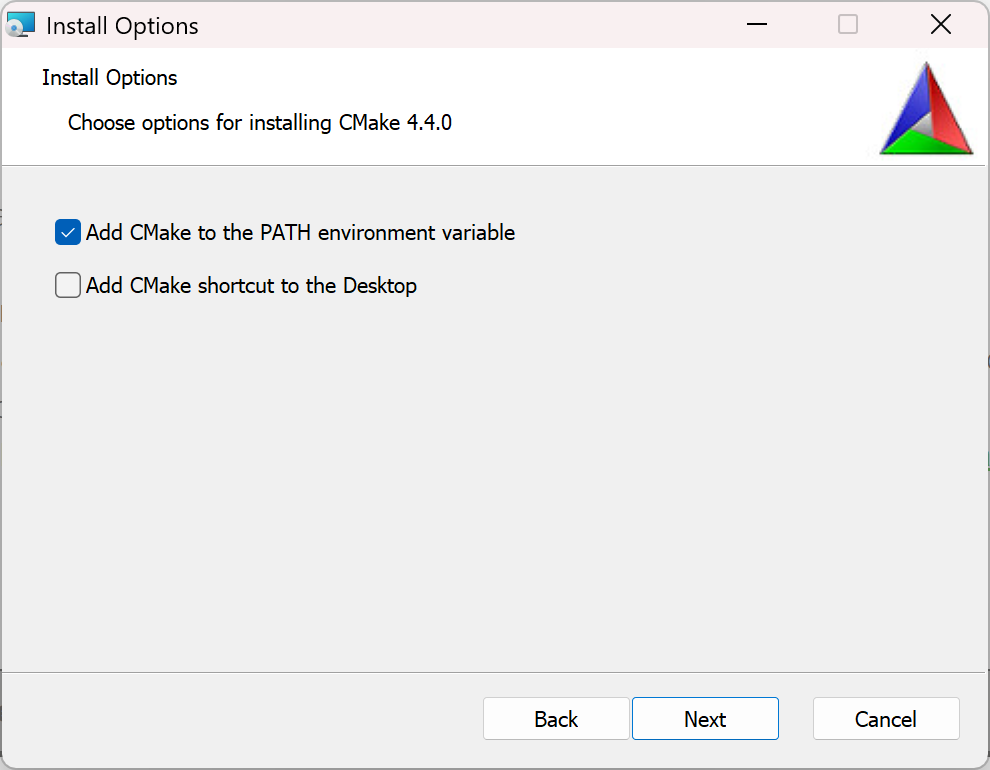

##### 工作流概述

一个典型项目：

```
MyProject
│
├── CMakeLists.txt
│
├── src
│   ├── main.cpp
│   └── math.cpp
│
├── include
│   └── math.h
│
└── build
```

流程：

```
CMakeLists.txt
        |
        |
        ↓
      CMake
        |
        |
        ↓
生成构建系统
        |
 ┌───────────────┐
 │               │
Ninja          MSBuild
 │               │
 ↓               ↓
clang++        cl.exe
 │
 ↓
程序
```

##### 核心文件`CMakeLists.txt`

最小实例：

```cmake
cmake_minimum_required(VERSION 3.20)

project(Hello)

add_executable(
    hello
    main.cpp
)
```

- `cmake_minimum_required`：指定最低 CMake 版本
- `project`：定义项目。只带一个参数则视为项目名。

##### Target思想

Target就是：

- 可执行文件
- 静态库
- 动态库

不使用全局变量，而是Target属性，只影响Target本身。

```cmake
add_executable(
    app
    main.cpp
)
```

生成：`app.exe`

##### 添加头文件路径

老方式，全局：

```
include_directories(
    include
)
```

现代方式：

```
target_include_directories(
    app
    PRIVATE
    include
)
```

##### 静态库

```cmake
add_library(
    math
    STATIC
    math.cpp
)
```

生成：`math.lib`

##### 动态库

```
add_library(
    math
    SHARED
    math.cpp
)
```

生成：`math.dll`

##### 链接库

```cmake
target_link_libraries(
    app
    math
)
```

##### 编译选项

开启 C++20：

```cmake
set(CMAKE_CXX_STANDARD 20)
```

现代推荐：

```cmake
target_compile_features(
    app
    PRIVATE
    cxx_std_20
)
```

---

---

### 包管理器

C++ 第三方依赖可能以不同形式存在：

- 只有头文件的库；
- 需要从源码构建的库；
- 预编译的静态库或动态库；
- 操作系统提供的系统库；
- 带有多个可选功能的复杂框架。

手动下载、编译和配置每个库会带来各种问题。

包管理器负责声明、获取、构建和缓存这些依赖。

#### vcpkg

##### 概述

vcpkg 是由 Microsoft 和 C++ 社区维护的免费开源 C/C++ 包管理器，可在 Windows、macOS 和 Linux 上运行。 它是核心的 C++ 工具，使用 C++ 和 CMake 脚本编写。 它旨在解决管理 C/C++ 库的独特难题。

> [官方文档](https://learn.microsoft.com/zh-cn/vcpkg/)

---

##### 安装<a id="vcpkg-install"></a>

###### 1.克隆仓库

在目录（如`C:\Environments\`（不要带空格））运行 cmd（在某些目录需要以管理员身份运行），执行：

``` cmd
git clone https://github.com/microsoft/vcpkg.git
```

###### 2.运行启动脚本

进入刚刚安装的 vcpkg 目录

``` cmd 
cd vcpkg
```

执行：

``` cmd
.\bootstrap-vcpkg.bat
```

###### 3.添加环境变量

进入“Windows 系统环境变量”面板，在系统变量添加变量 `VCPKG_ROOT`，值为安装目录：

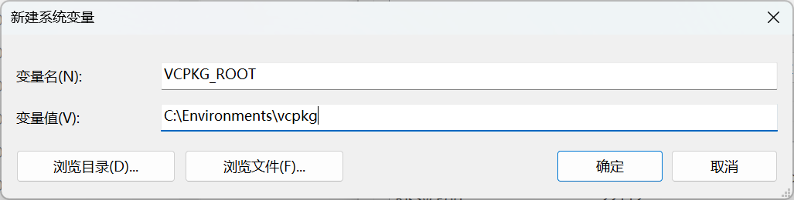

编辑 Path 变量，新建，加入：

> %VCPKG_ROOT%

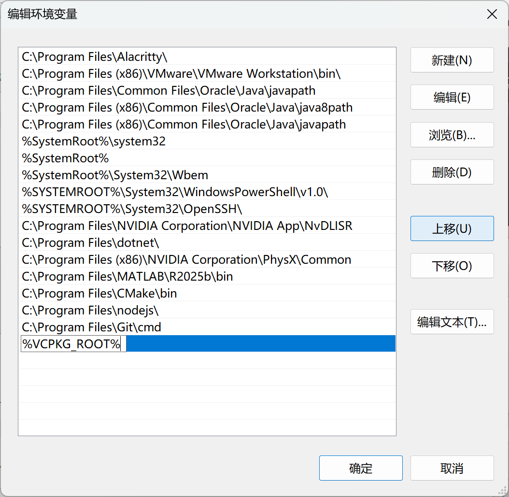

保存。

###### 4.检查

打开 cmd ，执行：

``` cmd
vcpkg --version
```

输出版本信息：

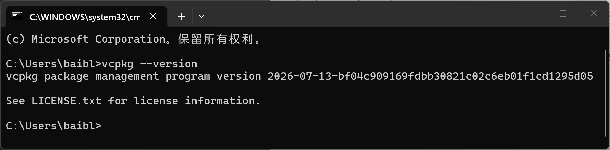

---

##### 相关文件

###### `vcpkg.json`

> 项目清单（Manifest）。描述项目信息、依赖等。

最简格式：

``` json
{
    "dependencies": []
}
```

> 已经合法，表明项目中无依赖

完整结构：

``` json
{
    "name": "my-project",
    "version": "1.0.0",
    "description": "Example project",
    "homepage": "https://github.com/example/my-project",

    "dependencies": [
        {
            "name": "fmt",
            "version>=": "11.0.0"
        },
        {
            "name": "opencv4",
            "features": [
                "core",
                "imgproc",
                "highgui"
            ]
        },
        "spdlog",
        "eigen3"
    ]
}
```

- `name`：项目名称。对于 application 非必须；对于 lib 建议填写。
- `version`：项目版本。对于 lib 建议填写。
- `description`：描述。无编译作用。
- `homepage`：项目主页
- `dependencies`（重点）：依赖库列表。可以直接写字符串，高级写法可以写对象，指定 version、features等信息。

###### `vcpkg-configuration.json`

> 包源配置。描述**从哪里获取这些依赖、使用哪个版本库**（仓库配置）。

默认：

``` json
{
    "default-registry": {
        "kind": "builtin",
        "baseline": "xxxxxxxxxxxxxxxxxxxxxxxx"
    }
}
```

> 只有一个配置，使用默认包源（官方 vcpkg 仓库）

- `baseline`：仓库某一次 Git 提交（commit）的哈希值。即进行版本锁定。

---

##### 基本使用

###### 0. CMake 项目中的配置

若要在 CMake 项目中 [使用](https://learn.microsoft.com/zh-cn/vcpkg/users/buildsystems/cmake-integration)vcpkg，需要将 `CMAKE_TOOLCHAIN_FILE` 变量设置为使用 vcpkg 的 CMake 工具链文件。 vcpkg 工具链位于 `%VCPKG_ROOT%/scripts/buildsystems/vcpkg.cmake`中，其中 `%VCPKG_ROOT%` 是 vcpkg 安装路径。

使用以下任一方法设置工具链文件：

- 在 `CMakePresets.json` 文件中设置 `CMAKE_TOOLCHAIN_FILE`。
- 在 CMake 配置调用中将 `-DCMAKE_TOOLCHAIN_FILE=<path/to/vcpkg>/scripts/buildsystems/vcpkg.cmake` 作为参数传递。
- 请在 `CMAKE_TOOLCHAIN_FILE` 文件中第一次调用 `project()` 之前，设置 `CMakeLists.txt` CMake 变量。

###### 初始化

``` bash
vcpkg new --application
```

最常用，创建应用项目。执行后添加`vcpkg-configuration.json`和`vcpkg.json`文件。

若创建库项目：

``` bash
vcpkg new --name mylib --version 1.0.0
```

参数：

- `--name`：初始化的项目名称
- `--version`：初始化的项目版本

###### 搜索

``` bash
vcpkg search [options] [query]
```

按名称和说明搜索可用的包。

搜索对所有可用的包名称和说明执行不区分大小写的搜索。 结果以表格格式显示。

###### 添加库

``` bash
vcpkg add port [options] <port-name>...
```

`vcpkg add port` 命令可以通过将新的包依赖项添加到 C++ 项目来更新 `vcpkg.json` 清单文件。

可以指定要添加的一个或多个端口名称。 还可以定义要作为依赖项包含的端口的特定功能。 然后，清单 (`vcpkg.json`) 将更新以反映这些更改。

示例：

``` bash
vcpkg add port fmt sqlitecpp zlib
```

> 添加 fmt、sqlitecpp、zlib 三个库

``` bash
vcpkg add port sqlitecpp[sqlcipher]
```

> 添加 sqlitecpp 库，features 为["sqlcipher"]

``` bash
vcpkg add port fmt --version=10.2.1
```

> 添加 fmt 库，版本 >= 10.2.1。若要精确固定版本，则到`vcpkg.json`删除对应的`>=`。

###### 删除库

严格执行`vcpkg.json`的清单模式暂不支持指令删除，需自行编辑`vcpkg.json`。

---

---

### 工作流

对于复杂的 C/C++ 环境，难以通过一行或数行命令就完全同步。不得不将编译工具链与构建器、包管理器分开管理。对于编译工具链、构建器与包管理器本体，提前安装，全局使用，项目中声明。

示例使用 VS Code IDE， Clang-cl + MSVC 编译器，CMake + Ninja 构建，vcpkg 包管理器，`cppvsdbg`调试器和`lldb`备用调试器。

#### 编译工具链安装

本节安装 Clang-cl + MSVC 编译器，并作一定讲解。

##### 1.下载微软安装器

前往[微软官网](https://visualstudio.microsoft.com/zh-hans/visual-cpp-build-tools/)，点击“**下载生成工具**”。

##### 2.选择下载项

打开工具，待其加载完成后，勾选“**使用 C++ 的桌面开发**”：

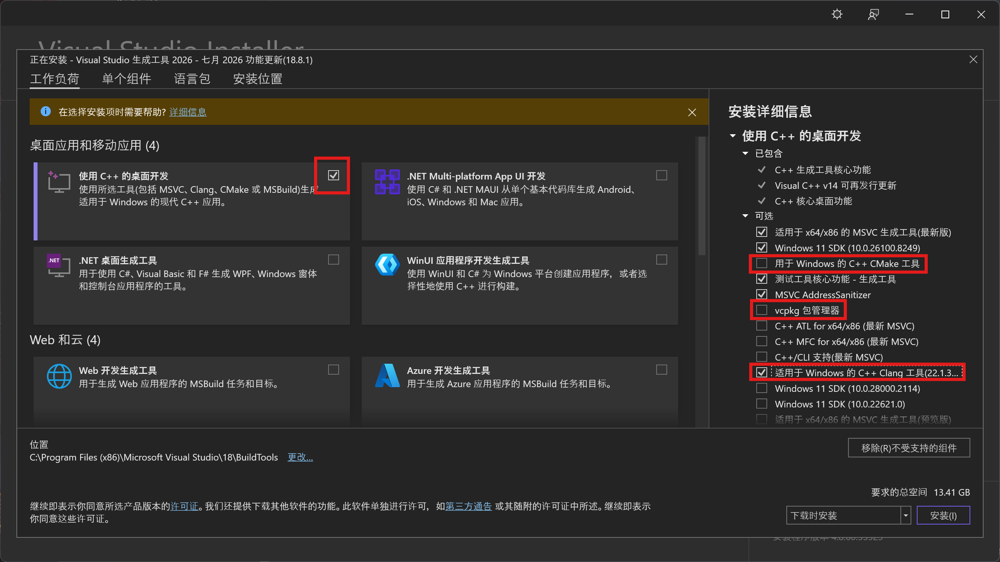

在右侧详细信息：

- 勾选“**适用于 Windows 的 C++ Clang 工具**”
- **取消**勾选“ **CMake 工具**”和“ **vcpkg 包管理器**”

> 之所以在这里取消勾选是因为我们会在后面单独全局安装这两个工具，从而如果未来有其他需求，需要使用其他编译链工具（如 MinGW）时，也可以便捷地使用它们。

安装。

##### 0.相关

安装后会多出这几项：

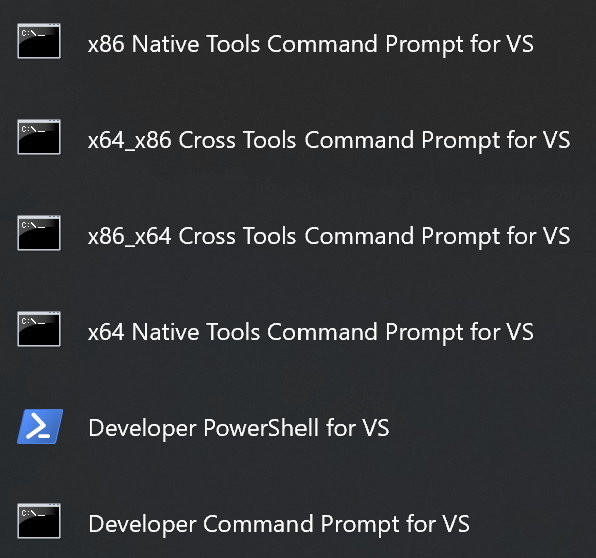

打开后，发现它们看起来就是普通的 `cmd`/`PowerShell` 。简单来说，Visual Studio Installer 下载完所选工具链后，没有将它们添加到系统变量。而这些新增加的终端内置了相关工具目录变量，只有在这些终端中，才可以直接通过命令调用各工具。这种同样是一种环境管理方式，使得计算机内安装多种环境时不会冲突。

通过运行 Visual Studio Installer ，可以随时回到刚才的安装选择界面，新增/删除相关工具或调整其版本。

---

#### 构建系统与构建器安装

##### 1.CMake

[CMake 安装](#cmake-install)

##### 2.Ninja

执行：

``` cmd
winget install Ninja-build.Ninja
```

用```ninja --version```验证。

---

#### 包管理器安装

[vcpkg 安装](#vcpkg-install)

---

#### VS Code 插件配置

##### 1.必须

- C/C++

  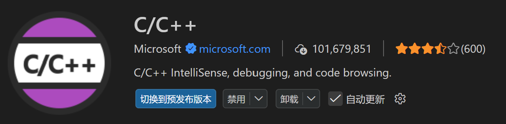

- CMake Tools


##### 2.推荐

- clangd


> 针对 clang 的代码检查/着色/补全。

- CodeLLDB


> LLVM开发的调试器，有跨平台等优势。会在后续作为备用调试器。

- Git Graph

  

> 更好的 Git 图像

- Run Button


> 就是在右上角加个调试按钮。

---

#### 单文件轻量编译配置

> 适合学习语法/刷题

##### 1.新建工程文件夹，用 VS Code 打开并信任

##### 2.建立 `build.bat`

> 每次编译时调用该脚本

新建一个`environment`文件夹，在其内建立一个 `build.bat`文件。

````file
```
└── 📁environment
    ├── build.bat
```
````

内容：

``` bat
@echo off

if "%~1"=="" (
    echo Usage: build.bat filename.cpp
    exit /b 1
)

rem 初始化 MSVC 编译环境
call "%ProgramFiles(x86)%\Microsoft Visual Studio\Installer\vswhere.exe" ^
 -latest ^
 -products * ^
 -requires Microsoft.VisualStudio.Component.VC.Tools.x86.x64 ^
 -property installationPath ^
 > "%TEMP%\vs_path.txt"
set /p VSROOT=<"%TEMP%\vs_path.txt"
call "%VSROOT%\Common7\Tools\VsDevCmd.bat" -arch=x64

rem 创建 build 目录
if not exist "%~dp0build" (
    mkdir "%~dp0build"
)

clang-cl ^
/std:c++20 ^
/EHsc ^
/Zi ^
/Fe:%~dp0build\%~n1.exe ^
%1
```

> 大意：找到最新的，x64的VS环境并运行 -> 创建 build 目录 -> 运行编译命令

- 若 Microsoft Visual Studio 没有安装在默认的 C:\Program Files (x86)\Microsoft Visual Studio，需自行将`%ProgramFiles(x86)%`改为安装的地址。

##### 3.建立 `vsx64.cmd`

> 相当于 [x64 Native Tools Command Prompt for VS](#####0.相关) 。

在`environment`文件夹下建立`vsx64.cmd`

内容：

``` bat
@echo off

call "%ProgramFiles(x86)%\Microsoft Visual Studio\Installer\vswhere.exe" ^
 -latest ^
 -products * ^
 -requires Microsoft.VisualStudio.Component.VC.Tools.x86.x64 ^
 -property installationPath ^
 > "%TEMP%\vs_path.txt"


set /p VSROOT=<"%TEMP%\vs_path.txt"

call "%VSROOT%\Common7\Tools\VsDevCmd.bat" -arch=x64

cmd /k
```

- 若 Microsoft Visual Studio 没有安装在默认的 C:\Program Files (x86)\Microsoft Visual Studio，需自行将`%ProgramFiles(x86)%`改为安装的地址。

##### 4.编写 `settings.json` 配置文件

Ctrl + Shift + P，搜索：`workspace settings`

选择：`首选项：打开工作区设置(JSON)`

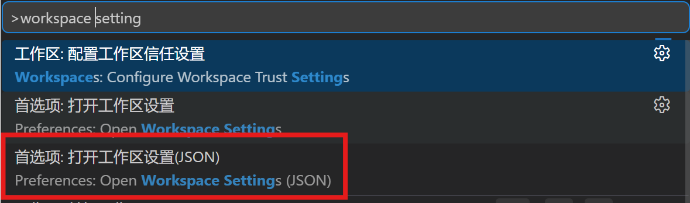

写入：

``` json
{
    "terminal.integrated.profiles.windows": {
        "VS x64 Native Tools": {
            "path": "${workspaceFolder}/environment/vsx64.cmd"
        }
    },

    "terminal.integrated.defaultProfile.windows": "VS x64 Native Tools"
}
```

> 大意：增加一个名为`VS x64 Native Tools`的终端，即上一步写的`vsx64.cmd`，并将其设为默认终端。
>
> 作用：使 VS Code 内的终端包含编译链相关工具的环境变量，如`clang-cl`。从而可以直接调用。

重启 VS Code。若设置成功，则终端上方会有如下 VS 相关字样：

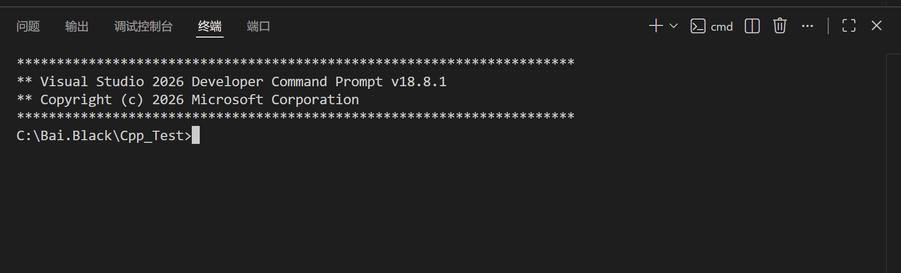

执行：

``` cmd
clang-cl --version
```

则会有版本相关信息返回。

##### 5.编写 `tasks.json` 配置文件

在`.vscode`文件夹内新建`tasks.json`文件，写入：

``` json
{
    "version": "2.0.0",
    "tasks": [
        {
            "label": "Build clang-cl",
            "type": "process",
            "command": "${workspaceFolder}\\environment\\build.bat",
            "args": [
                "${file}"
            ],
            "group": {
                "kind": "build",
                "isDefault": true
            },
            "problemMatcher": [
                "$msCompile"
            ]
        }
    ]
}
```

> 大意：建立一个名为`Build clang-cl`的编译预设，调用此前建立的`build.bat`脚本进行编译任务，并设为默认预设。

##### 6.编写 `launch.json` 配置文件

在`.vscode`文件夹内新建`launch.json`文件，写入：

``` json
{
    "version": "0.2.0",
    "configurations": [
        {
            "name": "vcdbg clang-cl",
            "type": "cppvsdbg",
            "request": "launch",
            "program": "${workspaceFolder}\\build\\${fileBasenameNoExtension}.exe",
            "cwd": "${workspaceFolder}",
            "console": "integratedTerminal",
            "preLaunchTask": "Build clang-cl"
        },

        {
            "name": "lldb clang-cl",
            "type": "lldb",
            "request": "launch",
            "program": "${workspaceFolder}\\build\\${fileBasenameNoExtension}.exe",
            "console": "integratedTerminal",
            "cwd": "${workspaceFolder}",
            "preLaunchTask": "Build clang-cl"
        }
    ]
}
```

建立了两种调试器预设：微软的`cppvsdbg`和 LLVM 的 `lldb`（需要CodeLLDB插件，若不需要则将第二个对象删除），可在 `运行于调试` 切换：

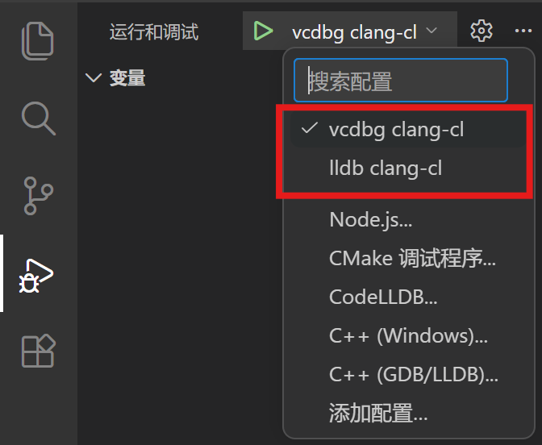

> - 如何选择两种调试器？
>
> | 对比项                | cppvsdbg                                | lldb                    |
> | --------------------- | --------------------------------------- | ----------------------- |
> | 调试引擎              | Visual Studio Windows Debugger（vsdbg） | LLVM LLDB               |
> | 开发方                | Microsoft                               | LLVM                    |
> | 平台                  | Windows 专用                            | Windows / Linux / macOS |
> | 最佳搭配              | MSVC、clang-cl                          | clang、clang-cl         |
> | PDB 支持              | ★★★★★                                   | ★★★★☆                   |
> | 跨平台一致性          | ★☆☆☆☆                                   | ★★★★★                   |
> | Windows API 调试      | ★★★★★                                   | ★★★☆☆                   |
> | 调试速度              | 很快                                    | 通常也很快              |
> | Natvis 支持           | 完整                                    | 部分支持                |
> | 与 Visual Studio 一致 | 是                                      | 否                      |

##### 0.最终框架

````file
```
└── 📁ProjectName
    └── 📁.vscode
        ├── launch.json
        ├── settings.json
        ├── tasks.json
    └── 📁environment
        ├── build.bat
        ├── vsx64.cmd
    └── main.cpp
```
````

---

#### 工程编译配置

> 加入 CMake 与 vcpkg

##### 1.新建工程文件夹，用 VS Code 打开并信任

##### 2.建立 `cmake-clang-cl.bat`

新建`environment`文件夹，在其内建立一个 `cmake-clang-cl.bat`文件。

````file
```
└── 📁environment
    ├── cmake-clang-cl.bat
```
````

写入：

``` bat
@echo off

call "%ProgramFiles(x86)%\Microsoft Visual Studio\Installer\vswhere.exe" ^
 -latest ^
 -products * ^
 -requires Microsoft.VisualStudio.Component.VC.Tools.x86.x64 ^
 -property installationPath ^
 > "%TEMP%\vs_path.txt"

set /p VSROOT=<"%TEMP%\vs_path.txt"

call "%VSROOT%\Common7\Tools\VsDevCmd.bat" -arch=x64

cmake %*
```

- 若 Microsoft Visual Studio 没有安装在默认的 C:\Program Files (x86)\Microsoft Visual Studio，需自行将`%ProgramFiles(x86)%`改为安装的地址。

> 大意：找到最新x64的VS环境，供后续 CMake 使用。

> 若在终端环境中出现网络问题，可在`cmake %*`的上方加入：
>
> ``` bat
> set "HTTP_PROXY=http://127.0.0.1:7890"
> set "HTTPS_PROXY=http://127.0.0.1:7890"
> set "NO_PROXY=localhost,127.0.0.1"
> ```
>
> 其中，`7890`使代理常用的端口号。具体可到使用的代理的设置中查询：
>
> 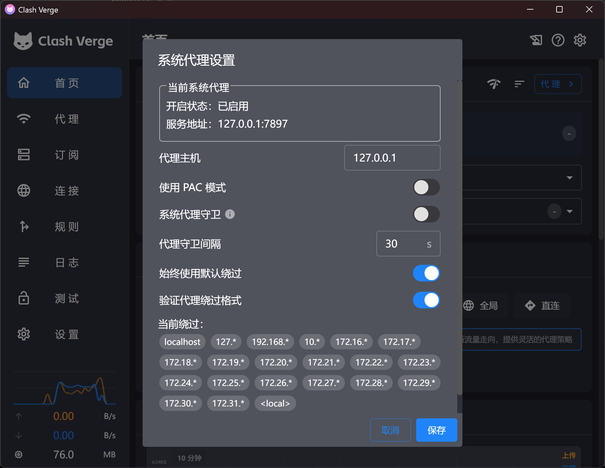
>
> 比如这里使用的端口是`7897`，则把两个`7890`改为`7897`。

##### 3.建立 `vsx64.cmd`

> 相当于 [x64 Native Tools Command Prompt for VS](#####0.相关) 。

在`environment`文件夹下建立`vsx64.cmd`

内容：

``` bat
@echo off

call "%ProgramFiles(x86)%\Microsoft Visual Studio\Installer\vswhere.exe" ^
 -latest ^
 -products * ^
 -requires Microsoft.VisualStudio.Component.VC.Tools.x86.x64 ^
 -property installationPath ^
 > "%TEMP%\vs_path.txt"


set /p VSROOT=<"%TEMP%\vs_path.txt"

call "%VSROOT%\Common7\Tools\VsDevCmd.bat" -arch=x64

cmd /k
```

- 若 Microsoft Visual Studio 没有安装在默认的 C:\Program Files (x86)\Microsoft Visual Studio，需自行将`%ProgramFiles(x86)%`改为安装的地址。

##### 4.建立 `windows-clang-cl.cmake`

在`environment`文件夹中新建`windows-clang-cl.cmake`，写入：

``` cmake
set(CMAKE_SYSTEM_NAME Windows)

set(CMAKE_C_COMPILER clang-cl)
set(CMAKE_CXX_COMPILER clang-cl)

set(CMAKE_CXX_FLAGS "/EHsc")

set(CMAKE_CXX_COMPILER_FRONTEND_VARIANT MSVC)
set(CMAKE_C_COMPILER_FRONTEND_VARIANT MSVC)
```

> 定义了使用的编译工具链

##### 5.编写 `settings.json` 配置文件

Ctrl + Shift + P，搜索：`workspace settings`

选择：`首选项：打开工作区设置(JSON)`


写入：

``` json
{
    "cmake.cmakePath": "${workspaceFolder}/environment/cmake-clang-cl.bat",
    
    "terminal.integrated.profiles.windows": {
        "VS x64 Native Tools": {
            "path": "${workspaceFolder}/environment/vsx64.cmd"
        }
    },

    "terminal.integrated.defaultProfile.windows": "VS x64 Native Tools"
}

```

> 大意：
>
> - 将CMake使用的终端路径改为刚才编写的`cmake-clang-cl.bat`；
>
> - 增加一个名为`VS x64 Native Tools`的终端，即上一步写的`vsx64.cmd`，并将其设为默认终端。
>
>   作用：使 VS Code 内的终端包含编译链相关工具的环境变量，如`clang-cl`。从而可以直接调用。

重启 VS Code。若设置成功，则终端上方会有如下 VS 相关字样：


执行：

``` cmd
clang-cl --version
```

则会有版本相关信息返回。

##### 6.生成基础 CMake

Ctrl + Shift + P，搜索：`cmake:quick`，

选择：`CMake:快速入门`

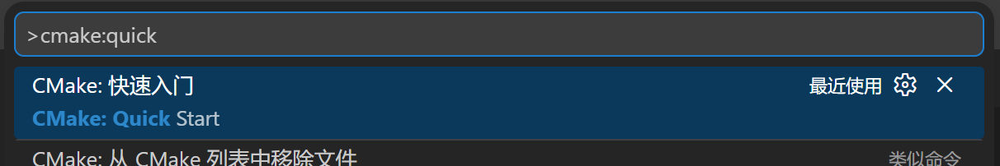

按需选择选项。到预设配置一步时，选择`添加新预设`

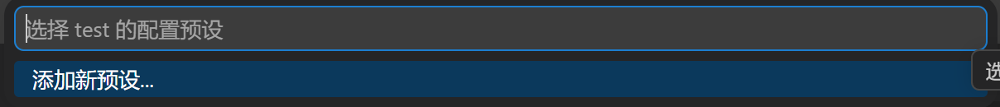

选择`工具链文件`

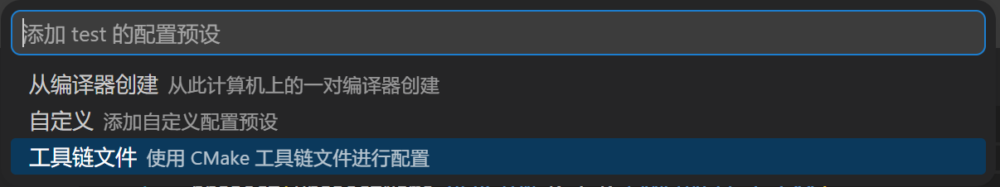

名称输入`windows-clang-cl`

完成后，工程根目录会增加`CMakeLists.txt`和`CMakePresets.json`两个文件。

打开`CMakeLists.txt`，加入：

``` cmake
# 输出目录
set(CMAKE_RUNTIME_OUTPUT_DIRECTORY
    ${CMAKE_SOURCE_DIR}/out/bin
)

set(CMAKE_LIBRARY_OUTPUT_DIRECTORY
    ${CMAKE_SOURCE_DIR}/out/bin
)

set(CMAKE_ARCHIVE_OUTPUT_DIRECTORY
    ${CMAKE_SOURCE_DIR}/out/lib
)
```

> 作用：区分输出目录

打开`CMakePresets.json`，修改为：

``` cmake
{
    "version": 8,
    "configurePresets": [
        {
            "name": "windows-clang-cl",
            "displayName": "Clang-cl Debug",
            "generator": "Ninja",
            "binaryDir": "${sourceDir}/out/build/${presetName}",
            "installDir": "${sourceDir}/out/install/${presetName}",
            "cacheVariables": {
                "CMAKE_BUILD_TYPE": "Debug",
                "CMAKE_TOOLCHAIN_FILE":"$env{VCPKG_ROOT}/scripts/buildsystems/vcpkg.cmake",
                "VCPKG_CHAINLOAD_TOOLCHAIN_FILE":"${sourceDir}/environment/windows-clang-cl.cmake"
            },
            "environment": {
                "VSCMD_ARG_TGT_ARCH": "x64"    
            }
        }
    ],
    "buildPresets": [
        {
            "name": "windows-clang-cl",
            "configurePreset": "windows-clang-cl"
        }
    ]
}
```

> 大意：增加一个名为`windows-clang-cl`的预设，使用`vcpkg.cmake`和刚才编写的`windows-clang-cl.cmake`编译链文件。

##### 7.初始化 vcpkg

在终端执行：

``` bash
vcpkg new --application
```

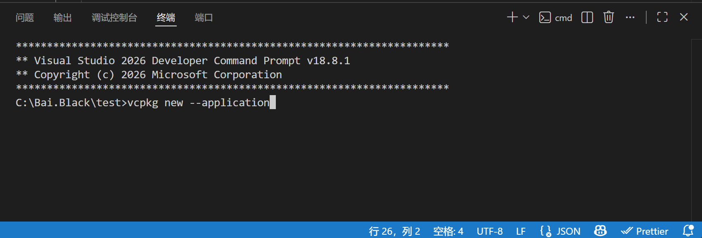

##### 8.配置 CMake

Ctrl + Shift + P，搜索：`cmake:delete`

选择：`CMake:删除缓存并重新配置`

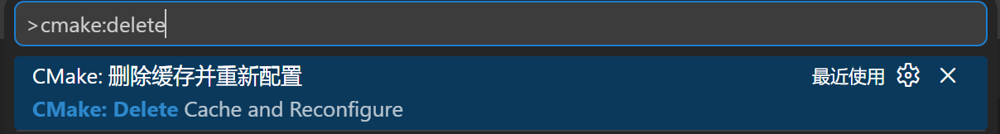

##### 9.编写 `launch.json` 配置文件

在`.vscode`文件夹内新建`launch.json`文件，写入：

``` json
{
    "version": "0.2.0",
    "configurations": [
        {
            "name": "vcdbg clang-cl",
            "type": "cppvsdbg",
            "request": "launch",
            "program": "${command:cmake.launchTargetPath}",
            "cwd": "${command:cmake.launchTargetDirectory}",
            "console": "integratedTerminal"
        },

        {
            "name": "lldb clang-cl",
            "type": "lldb",
            "request": "launch",
            "program": "${command:cmake.launchTargetPath}",
            "cwd": "${command:cmake.launchTargetDirectory}",
            "console": "integratedTerminal"
        }
    ]
}
```

> 大意：添加了两种调试器预设：`vcdbg clang-cl`和`lldb clang-cl`

##### 10.建立 `.clangd`文件

> 安装了 clangd 插件的情况下执行这一步。

在工程根目录建立`.clangd`文件，写入：

``` clangd
CompileFlags:
  CompilationDatabase: out/build/windows-clang-cl
```

> 大意：渲染代码提示时从`out/build/windows-clang-cl`下寻找库文件。

##### 11.初始化git

在终端运行：

``` bash
git init
```

##### 12.建立`.gitignore`文件

写入：

``` gitignore
#.vscode配置文件
/.vscode/

#编译文件
/out/

#clangd配置文件
/.clangd
```

##### 13.按需编写`CMakeLists.txt`、在 `vcpkg.json`内添加依赖、设计项目源文件结构

##### 0.最终基本框架

````file
```
└── 📁ProjectName
    └── 📁.vscode
        ├── launch.json
        ├── settings.json
    └── 📁environment
        ├── cmake-clang-cl.bat
        ├── vsx64.cmd
        ├── windows-clang-cl.cmake
    ├── .clangd
    ├── .gitignore
    ├── CMakeLists.txt
    ├── CMakePresets.json
    ├── vcpkg-configuration.json
    ├── vcpkg.json
    └── main.cpp
```
````

